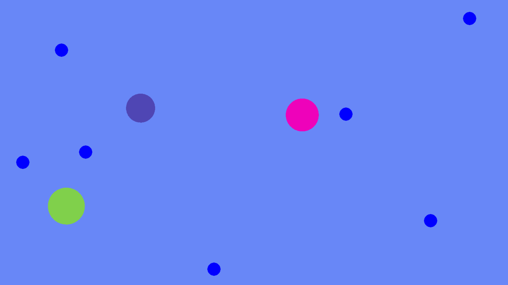
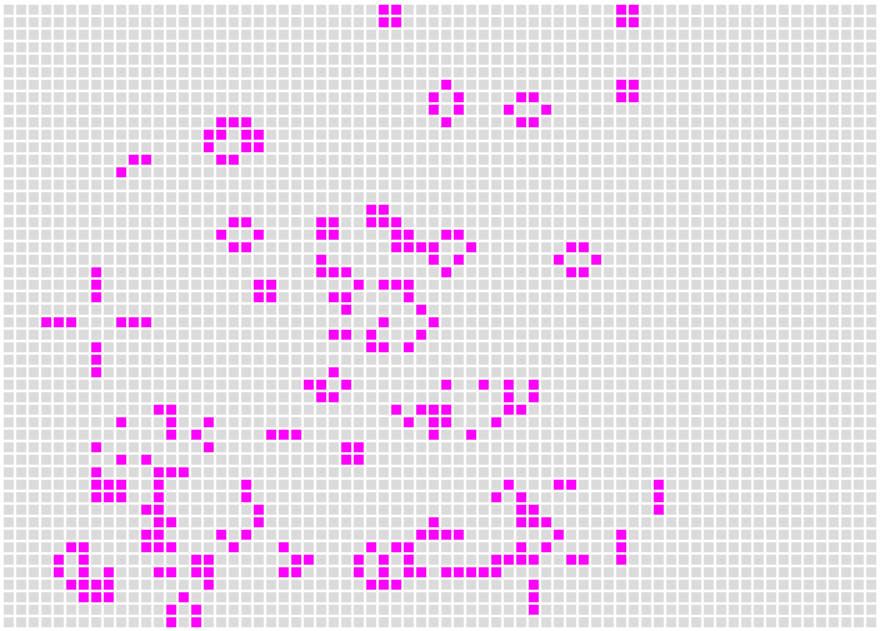
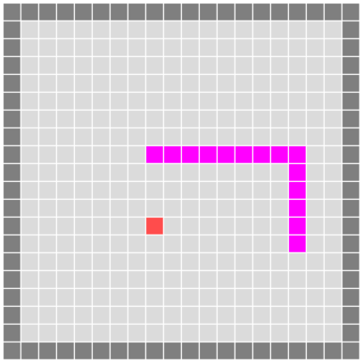

# Ohjelmakoodinäytteet

Projekteja on viisi kappaletta. Projektit "Cells", "Game of Life", "Neural Network" ja "Snake" on toteutettu Lualla ja erittäin kevyellä ja elegantilla LÖVE-pelimoottorilla. Näiden projektien testaaminen on äärimmäisen helppoa: voit ladata LÖVE-pelimoottorin osoitteesta

https://love2d.org/

ja kun pelimoottorin asennus on valmis, niin voit testata projektia vetämällä projektikansion LÖVE-pikakuvakkeen päälle, jolloin pelin suoritus alkaa.

Projekti "Robot" on ohjelmistorobotiikkaprojekti ja se on toteutettu Pythonilla. Projektia on helppo testata venv-ympäristössä, kun asentaa tiedoston "requirements.txt" vaatimat riippuvuudet.

## Cells

Tämä on Lualla ja LÖVE-pelimoottorilla toteutettu solusimulaatio. Solut syövät näytölle ilmestyviä ruokia, kasvavat ja lopulta jakautuvat. Jos solu ei saa ruokaa pitkään aikaan, häviää näytöltä. Uusia soluja voi luoda välilyönnillä ja peli sulkeutuu Esc-näppäimellä. Tätä simulaatiota voisi laajentaa esimerkiksi lisäämällä toisia soluja syöviä petosoluja ja lisäämällä jonkinlaista evoluutiota soluille.

## Game of Life

Klassinen Conwayn "elämänpeli", joka osoittaa, kuinka yksinkertaisilla säännöillä voidaan luoda monimutkaisia, lähes elämänkaltaisia emergenttejä kuvioita. Voit luoda halutun alkutilanteen piirtämällä hiirellä (vasen hiirennäppäin pohjassa) alkukuvion ja sen jälkeen voit simuloida seuraavia askeleita painamalla välilyöntiä. Jatkuvan simulaation saa aikaiseksi pitämässä välilyöntiä pohjassa.

Lisätietoa pelin taustasta löytyy osoitteesta

https://en.wikipedia.org/wiki/Conway%27s_Game_of_Life

## Neural Network

Lualla toteutettu neuroverkko. Olen käyttänyt inspiraationa Tariq Rashidin kirjaa "Make Your Own Neural Network". Kyseisessä kirjassa neuroverkko on toteutettu Pythonilla.

Projektissa neuroverkko koulutetaan sadalla käsinpiirretyllä numerolla ja tämän jälkeen testataan neuroverkon tunnistuskykyä kymmenellä testitapauksella. Oikeita tuloksia tulee 60 %, mikä on jo melko hyvä suoritus melko rajallisella koulutusdatalla. Olen päässyt laajemmalla koulutusdatalla jopa 97 % tarkkuuteen.

## Snake

Klassinen matopeli, joka on toteutettu Lualla ja LÖVE-pelimoottorila. Olen laajentamassa peliä siten, että madon ohjausta hallinnoi aiemmin mainittu neuroverkko, ja neuroverkon painokertoimia muokataan evoluutioalgoritmin avulla. Ainakin teoriassa neuroverkon pitäisi oppia pelaamaan matopeliä, joskin alustavien tulosten perusteella madot alkavat helposti kiertämään kehää. Tämän ongelman luultavasti saa ratkaistua paremmalla evoluutioalgortimin fitness-funktiolla.

## Robot

Yksinkertainen Pythonilla ja Seleniumilla toteutettu ohjelmistorobotiikan framework. Esimerkkitehtävässä käytetään minun omaa nettisivua

https://manifoldmath.com/